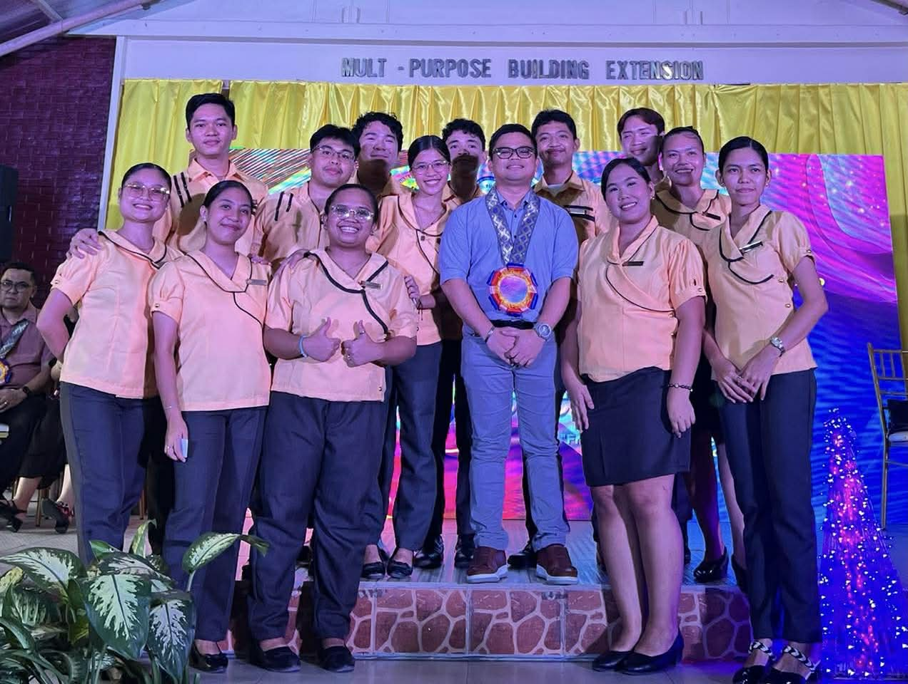
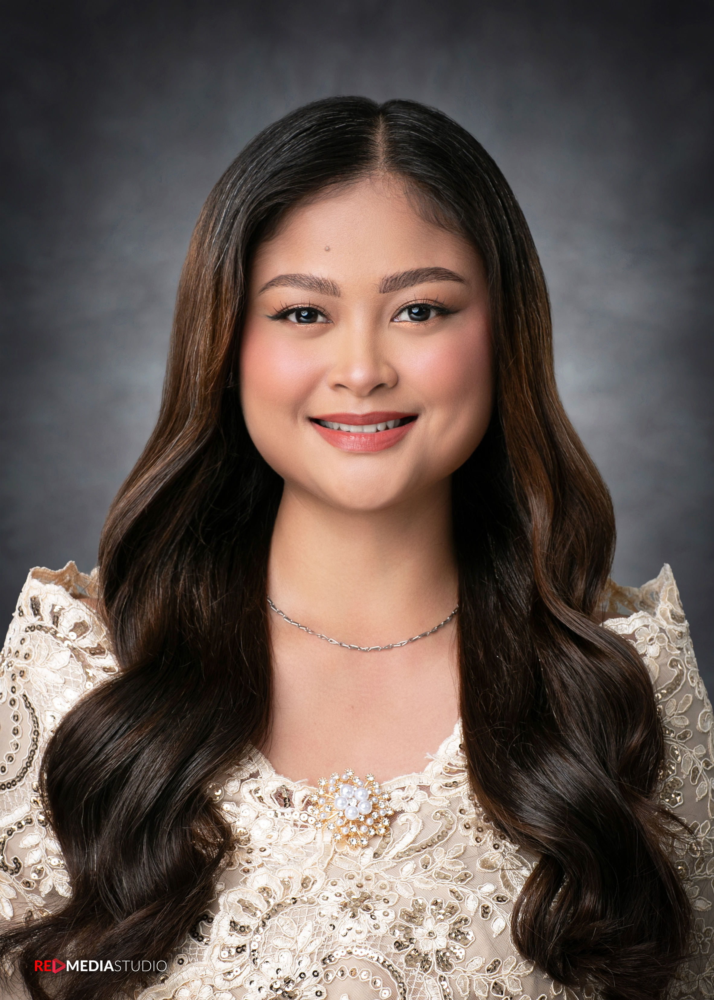
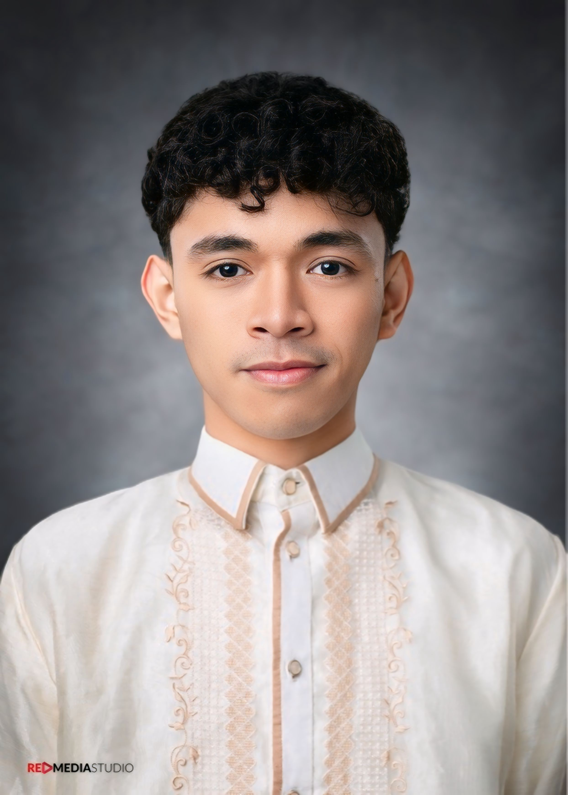

### Scott Alao

### Cezel Joy Bayon-on

Cezel Joy L. Bayon-on is an undergraduate student at Cebu Normal University – Main Campus, currently pursuing a Bachelor of Secondary Education major in Science. 

Her academic focus centers on science education, with particular interests in learning-by-doing approaches, educational technology, and student engagement and assessment. She is actively involved in research that explores the use of interactive and technology-driven strategies to enhance students’ understanding of scientific concepts. 

Bayon-on has demonstrated leadership through her role as Assistant Parish Youth Coordinator (Internal) and as Head of the Communication Team during National Youth Day. She has also participated in various educational and catechetical workshops and seminars that support her development as a future educator. In addition, she has contributed to community learning through her involvement in the Tara Basa Tutoring Program for two consecutive years. She aspires to advance innovative and learner-centered practices in science education through both teaching and research.

### Lovely Jean Cohina

### Marythelle Geotoro

Marythelle L. Geotoro is an undergraduate student at Cebu Normal University, currently pursuing a Bachelor of Secondary Education major in Science. She is committed to developing effective and meaningful science instruction that promotes active student engagement and understanding. She is interested in science education and believes that students learn best through hands-on and experiential learning. She values learning by doing and aims to make science lessons more relatable to students’ daily lives. Through her academic journey, she hopes to encourage curiosity and think more deeply about what they learn. Beyond her academic work, she serves as a tutor in Tara, Basa, a program of the Department of Social Welfare and Development (DSWD), where she supports learners in developing their reading skills. Through this experience, she developed a stronger passion for helping students and promoting inclusive education. She hopes to contribute to science education by meeting students where they are and supporting their learning based on their individual needs and experiences.

### Rossangellie Mae Goles

### Zeal Xyrelle Ilustrisimo

Zeal Xyrelle A. Ilustrisimo is a Science Student Teacher at Cebu Normal University, currently pursuing a degree in science education with a focus on general science and practical teaching strategies. Her academic interests include improving science literacy, using interactive approaches in the classroom, and helping students better understand scientific concepts. She values clear communication and meaningful learning experiences that connect lessons to real-life situations. She previously served as a tutor in Tara, Basa! Tutoring Program of the Department of Social Welfare and Development (DSWD), where she assisted young learners in developing their reading skills. This experience strengthened her ability to guide learners with patience and adaptability. Ilustrisimo is committed to continuous growth and to becoming an effective and reflective science educator.

### Jeyson Lanuza

Jeyson F. Lanuza is a 4th-Year Undergraduate Student at Cebu Normal University, currently pursuing a degree in Bachelor of Secondary Education major in Science with a focus on General Science. He previously served as a Tutor and Youth Development Worker in the Tara, Basa! Tutoring Program of the Department of Social Welfare and Development (DSWD), where he assisted young learners in developing their reading skills and parents in strengthening their literacy support. This experience strengthened his ability to guide learners with patience, adaptability, and effective communication. Through his academic training and field experiences, he has developed competencies in classroom management and student engagement. Mr. Lanuza is currently in his final year as a student and Pre-Service Teacher, actively completing his professional training and preparing for his future career in the teaching profession. He is committed to continuous growth and to becoming a reflective, competent, and student-centered educator.

### James Genesis Lola

James Genesis I. Lola is a fourth-year undergraduate student at Cebu Normal University, where he is currently pursuing a Bachelor of Secondary Education majoring in Science. His academic journey is driven by a deep-seated interest in understanding both the vast complexities of the cosmos and the critical ecological systems of our planet. Specifically, his research interests focus on the intersections of Astronomy and Environmental Science, aiming to contribute to a holistic understanding of Earth’s place in the universe. As a pre-service educator, he is committed to bridging the gap between complex scientific concepts and accessible classroom instruction. Mr. Lola is actively engaged in his final year of study, preparing to enter the professional field with a strong foundation in scientific inquiry and pedagogy. His current work reflects a dedication to advancing scientific literacy and environmental stewardship within the academic community.

### James Bryle Manigos

James Bryle L. Manigos is an undergraduate student at Cebu Normal University, currently pursuing a Bachelor of Secondary Education major in Science. His academic interests focus on science education and educational technology, with an emphasis on innovative teaching strategies that enhance student learning outcomes. He has actively engaged in academic and leadership roles, serving as a Bloc Chairperson from 2022 to 2025 across multiple semesters. In addition, he contributed to community development as a Youth Development Worker under the DSWD Tara, Basa! Tutoring Program in 2024 and 2025. His experiences reflect a strong commitment to both educational excellence and community service. Through his academic and extracurricular involvement, he continues to develop competencies relevant to teaching, research, and educational leadership.

### Kyla Melendres

Kyla A. Melendres is an undergraduate student at Cebu Normal University, currently pursuing a Bachelor of Secondary Education major in Science. Her academic interests focus on developing effective strategies for teaching scientific concepts in ways that are accessible and engaging for learners. She is particularly inclined toward experiential learning and the use of hands-on activities to enhance students’ understanding and retention. Kyla aims to become a dedicated science teacher who simplifies complex topics and fosters a positive learning environment. She believes that meaningful learning occurs when students actively participate and connect lessons to real-life experiences. Through her training, she continues to build the skills necessary to support diverse learners in achieving academic success.

### Euniece Niña Tanudtarnud

Euniece Nina S. Tanudtanud is an undergraduate student pursuing a Bachelor of Secondary Education major in Science at Cebu Normal University, where she is currently serving as a teaching intern. Her teaching philosophy emphasizes student-centered approaches, particularly through experiential learning and hands-on activities. Her research interests focus on technology-driven innovation and the life sciences. She has demonstrated strong leadership as a former Supreme Student Government (SSG) President and Vice President, as well as a youth leader. Through these experiences, she has developed a commitment to fostering student engagement and community involvement. 

### Jonar Khen Tobes

Jonar Khen E. Tobes is a Bachelor of Secondary Education major in General Science undergraduate student at Cebu Normal University, where he is actively engaged in academic research. His interests include anti-cancer research, molecular docking and analysis, and pedagogical approaches to learning, particularly behaviorism. He has demonstrated technical competence through his successful performance of 3D molecular docking and analysis. He was also part of the documentation team during the National Youth Day, contributing to large-scale collaborative efforts. In addition, he served as a Tara! Basa volunteer under the Department of Social Welfare and Development in partnership with Cebu Normal University, reflecting his commitment to community service. Separately, he co-authored an action research study focusing on different teaching models, highlighting his engagement in educational inquiry. He also gained experience as a Youth Development Worker, further strengthening his involvement in youth-centered initiatives.

### Ma. Elaine Velvestre

Ma. Elaine F. Velvestre is an undergraduate student at Cebu Normal University – Main Campus, currently pursuing a Bachelor of Secondary Education with a major in Science. She has developed a strong academic foundation in science education, with particular interests in teaching and learning strategies, community-based education, youth development, and academic support initiatives. She has demonstrated commitment to service through her role as a volunteer tutor at a local community center and her involvement as an officer in Kabataan Kontra Droga at Terorismo (KKDAT) and the Barangay PYAP Federation. Her academic excellence is reflected in multiple honors received throughout her primary and secondary education, as well as recognitions in division-level competitions. She is known for her effective communication skills, adaptability, and resourcefulness in both academic and community settings. With a proactive and collaborative approach, she aims to contribute meaningfully to the field of science education and learner development.

