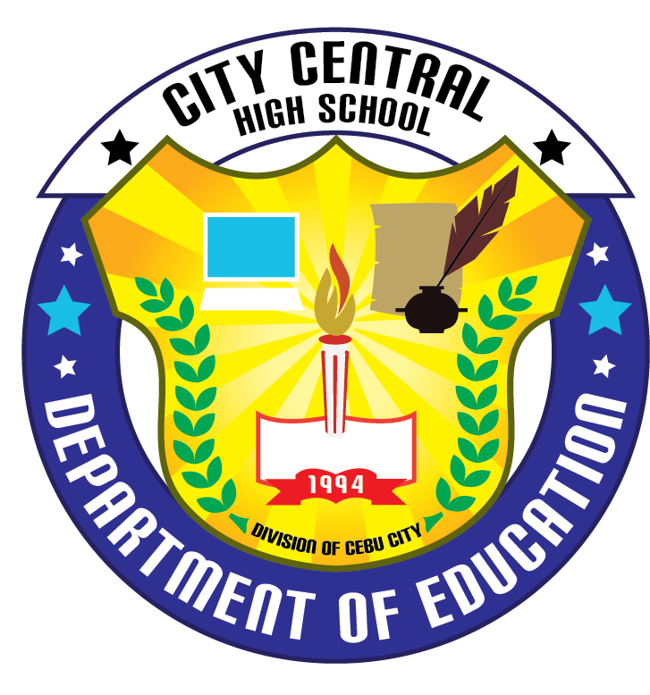

# Cebu Normal University - Integrated Laboratory School
The Cebu Normal University - Integrated Laboratory School (CNU-ILS) is a highly competitive basic education institution in Cebu City, Philippines, that offers early childhood, elementary, and junior high school programs while serving as the primary training ground for the university's College of Teacher Education. Operating under the umbrella of CNU—a premier teacher-training university—the ILS functions as a real-world "laboratory" where university interns complete their practice teaching under the supervision of seasoned faculty, creating a dynamic and innovative learning environment for the students. Beyond its rigorous academics and strict admission standards, CNU-ILS is recognized for its pioneering multigrade teaching advocacy and active student life, successfully balancing the delivery of quality holistic education to young learners with its crucial mission of shaping the next generation of top-tier Filipino educators.

# City Central National High School
City Central National High School is a public high school located in the heart of Cebu City, Philippines. It offers a comprehensive curriculum that enables students to achieve academic excellence and personal growth. The school is known for its dedicated and highly qualified faculty members who are passionate about nurturing students' talents and inspiring them to reach their full potential. Extracurricular activities such as sports, arts, and community service are available to ensure a well-rounded education. The school aims to empower the youth of Cebu City and prepare them to become responsible and productive members of society.
