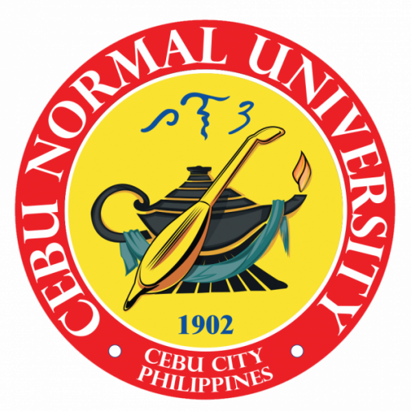
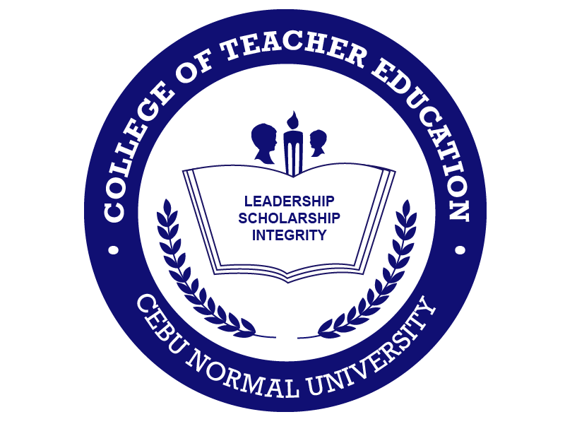

## Cebu Normal University
Osmeña Boulevard, Cebu City Philippines 6000

Cebu Normal University (CNU) is a prestigious state university in Cebu City, Philippines, known for its excellence in education and community service, with a rich history dating back to 1902.

It was established in 1902 as a provincial normal school, initially serving as a branch of the Philippine Normal School. It became an independent institution in 1924, was designated a chartered college in 1976, and achieved university status in 1998. CNU is one of the oldest educational institutions in Cebu, with a significant role in training teachers and other professionals. 

CNU offers a wide range of academic programs, particularly excelling in teacher education and nursing. It has been recognized by the Commission on Higher Education (CHED) as a Center of Excellence in these fields. The university aims to develop competent and values-driven individuals through quality instruction, relevant research, and responsive extension programs. 

### Vision

By 2027, CNU a Globally Recognized Institution as Agile and Technologically-Proofed SMART (GREAT SMART CAMPUS)

### Mission

“Developing graduates equipped with world-class competences and imbued with positive values for them to be future-proof ready and become great leaders, professionals and stewards in their chosen vocation and of the society amidst destructive, volatile, uncertain, complex, ambiguous and divergent (DVUCAD) conditions”.

### Development Goal Philosophy

<B> G </b>– Good governance and administrative services agile to the ever-changing needs and expectations of the academic community and service areas as well as the development trends in the corporate and regulatory sectors.

<b>R </b> – Research and development programs, projects and studies attuned with and contributory to the international, national, regional and local R&D thrusts that would enhance ingenuity, innovation, creativity, intellectual property rights, and scientific capabilities of the faculty members and students and thereby meaningfully enrich the body of knowledge of various disciplines and strengthen the income generating projects and resource generation of the University.

<b>E</b> – Extension services that shall serve as a catalyst for positive and meaningful transformation of the lives of the disadvantaged and vulnerable individuals for them to contribute productively in attaining progress in their respective communities.

<b>A</b> – Academic programs and services capable of preparing students to be future-proof ready and resilient amidst rapid societal and technological changes.

<b>T</b> – Technology inclusive through SMART Campus modality in the delivery of administrative services and the fourfold functions of the University namely, instruction, research, extension and production.

## College of Teacher Education

The College of Teacher Education envisions its graduates from the different degree programs to demonstrate technological, pedagogical content knowledge (TCPCK) imbued with the essential skills that prepare them for excellence in the delivery of relevant, meaningful and facilitative instruction in the basic education. Moreover, the college aspires its graduates to be leaders in promoting education for sustainable development addressing emerging socio-cultural, economic, and environmental concerns.